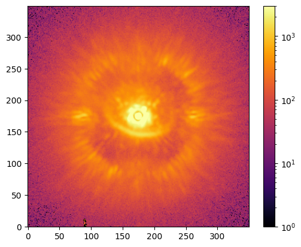
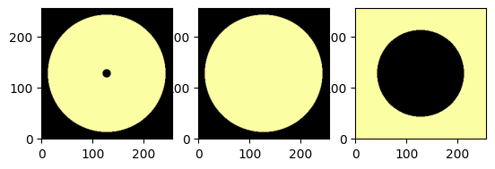

# Astro VAE: Exoplanet Disk Background Removal

This project applies a deep learning model—specifically a Variational Autoencoder (VAE)—to improve imaging of exoplanetary disks by removing background noise from astronomical FITS images.

## Project Structure

- [`Astro_VAE_Modeling_V1.ipynb`](https://github.com/astraeus999/POLARIS_img_analysis/blob/main/VaeImputation/Astro_VAE_Modeling_V1.ipynb): Main notebook for background removal using VAE.
- [`assets/`](https://github.com/astraeus999/POLARIS_img_analysis/tree/main/VaeImputation/assets): Contains `.fits` files used for training and masking.
- [`astro_vae_package/`](https://github.com/astraeus999/POLARIS_img_analysis/tree/main/VaeImputation/astro_vae_package): Custom utilities and plotting tools.

## Getting Started

### Prerequisites

Install the required Python packages:

```bash
pip install numpy astropy matplotlib opencv-python imageio tensorflow torch scikit-learn
```

### Run the Notebook

1. Launch Jupyter Notebook or VSCode.
2. Open [`Astro_VAE_Modeling_V1.ipynb`]((https://github.com/astraeus999/POLARIS_img_analysis/blob/main/VaeImputation/Astro_VAE_Modeling_V1.ipynb)).
3. Execute the cells in order to:
   - Load FITS 
   - Apply spatial 
   - Train and evaluate the VAE model

## Model Overview

The project utilizes a PyTorch-based Variational Autoencoder (VAE) to reconstruct clean versions of images by learning from control regions (ring masks) and predicting noisy or masked regions. The model construction is in [`astro_vae_package/vae_model.py`](https://github.com/astraeus999/POLARIS_img_analysis/blob/main/VaeImputation/astro_vae_package/vae_model.py)

## Visualization

Output plots and intermediate steps are visualized using Matplotlib and saved as images or PDF files.

## Notes

- GPU support is included using PyTorch (`torch.cuda.is_available()`).
- FITS image files are preprocessed using `utils.crop_central_squared_image`.

## Acknowledgments

This project builds on earlier work by Fang and integrates custom astronomy utilities for image masking and visualization.
